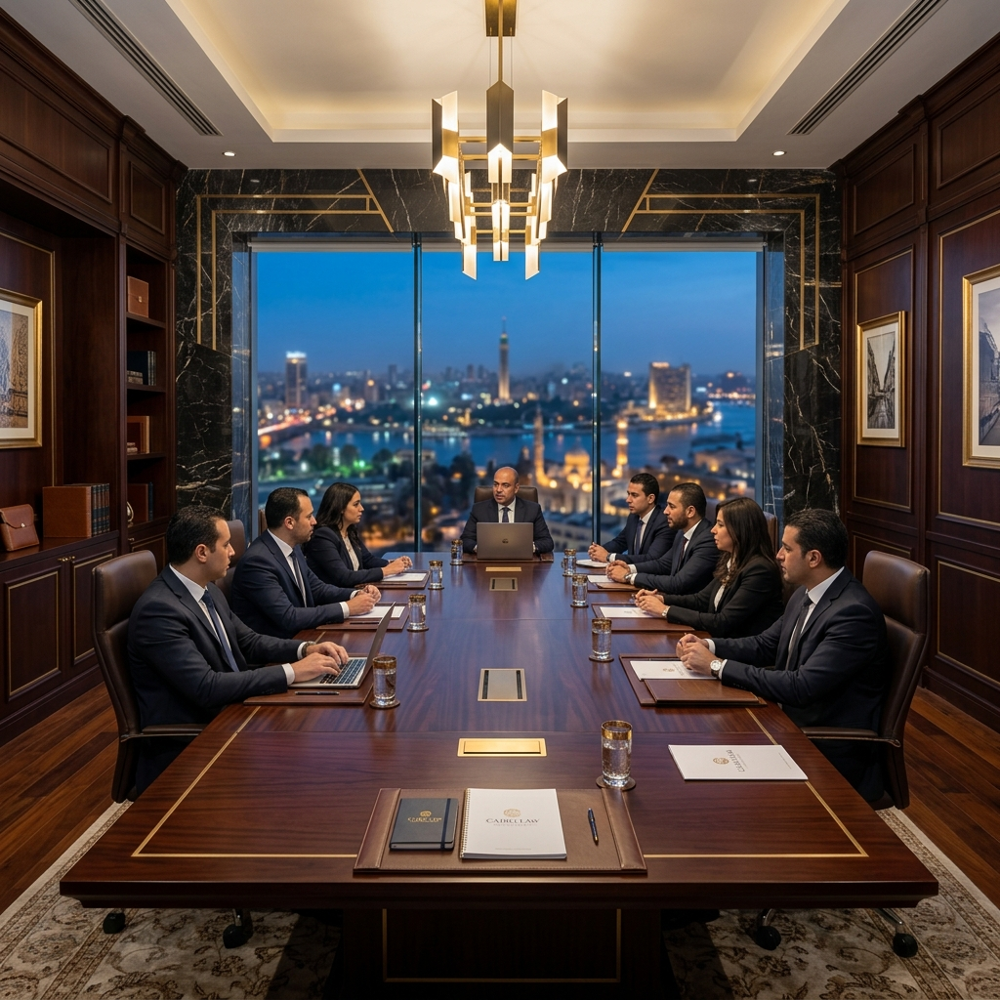

# Premium Animations — Integration Guide

This branch (`feature/premium-animations`) adds a **drop-in enhancement layer** that you activate via markup classes and one extra CSS / JS file. **No existing source files are modified.**

---

## What Was Added

| File | Purpose |
|---|---|
| `css/enhancements.css` | 17 visual effects: cursor, grain, tilt, glow, marquee, parallax, split-text, scroll progress, … |
| `js/enhancements.js` | Vanilla JS engine that powers those effects (mutations observer, mouse tracking, IO, RTL-safe). |

Existing files (`index.html`, `about.html`, `services.html`, `expertise.html`, `contact.html`, `css/style.css`, `js/main.js`, `js/translations.js`) **are not modified** — you stay in full control of when to opt-in.

---

## How To Activate (Two Steps)

### Step 1 — Load the new files in your HTML

Open any HTML file (e.g. `index.html`) and **just before `</head>`**, add:

```html
<link rel="stylesheet" href="css/enhancements.css">
```

And **just before `</body>`**, add:

```html
<script src="js/enhancements.js"></script>
```

After the existing:

```html
<link rel="stylesheet" href="css/style.css">
<!-- ... -->
<script src="js/translations.js"></script>
<script src="js/main.js"></script>
```

> **Why two files and not one?** Cleaner — you can opt out by simply removing the two new lines.

### Step 2 — Opt into individual effects via classes

The enhancements turn on **only** for elements you mark. Nothing is global. The list below is the entire opt-in vocabulary.

| Effect | Class / attribute | Where to apply |
|---|---|---|
| **3D tilt on hover** | `lpg-tilt` | Card containers (`service-card`, `team-card`, `why-card`) |
| **Glowing border on hover** | `lpg-glow` | Any block you want a premium hover ring on |
| **Magnetic pull (button)** | `lpg-magnetic` | Primary CTA buttons, language switcher |
| **Parallax scroll** | `data-parallax="0.3"` | Hero graphic, attorney photos, abstract map SVG |
| **Staggered children** | `lpg-stagger-children` | A parent whose direct children should fade in one-by-one |
| **Manually pick delay** | `lpg-stagger-1` … `lpg-stagger-8` | A child element with custom delay (1 = fastest) |
| **Word-by-word reveal** | `lpg-split` | Hero `<h1>`, section headings — words rise from a clip mask |
| **Directional reveal** | `reveal-left` / `reveal-right` / `reveal-scale` | Section halves to slide in from a side or scale up |
| **Scroll progress bar** | *(automatic, fixed top)* | Always visible once enhancements.js loads |
| **Custom gold cursor** | *(automatic on hover-capable devices)* | Replaces the default cursor with a ring + dot |
| **Film-grain texture** | *(automatic, full-page)* | Fixed overlay at 3.5% opacity — gives the dark theme a "shot on film" feel |
| **Ambient hero glow** | *(automatic in `.hero`)* | Soft gold radial that breathes behind the hero text |
| **Animated gradient border** | `lpg-animated-border` | The brand logo, footer brand area |
| **Live indicator dot** | `lpg-pulse-dot` | Useful for "now serving" or "live consultation" markers |
| **Animated underline** | `lpg-underline` | Inline anchor links — underline draws on hover |

### Reduced Motion

Every animation is gated by `@media (prefers-reduced-motion: reduce)`. Users who set OS-level "reduce motion" see a static site. Zero JS work needed on your side.

### RTL

The marquee flips direction when the page goes to `ar`. The `reveal-left` / `reveal-right` classes auto-invert so animations feel native in Arabic too.

---

## Recommended Opt-In Plan (homepage demo)

Below is a copy-paste block of classes you could add to the existing `index.html` to see the whole layer in action. **Don't apply these all at once** — apply them in pairs and refresh.

### Hero

```html
<h1 class="lpg-split" data-i18n="hero_title">A New Standard of Legal Solutions…</h1>
<svg class="graphic-shield" data-parallax="0.25">…</svg>
<a href="contact.html" class="btn btn-solid lpg-magnetic" …>Immediate Consultation</a>
```

### Service cards

```html
<div class="service-card reveal lpg-tilt lpg-glow">
    <div class="lpg-tilt-inner">
        <!-- existing content -->
    </div>
</div>
```

### Team cards

```html
<div class="team-photo" data-parallax="0.15">
    
</div>
```

### Why-Us grid

```html
<div class="why-grid lpg-stagger-children">
    <div class="why-card reveal lpg-glow">…</div>
    <div class="why-card reveal lpg-glow">…</div>
    <!-- ... -->
</div>
```

### About image

```html
<div class="about-img-frame reveal-left lpg-glow">
    <div class="about-image" data-parallax="0.2">
        
    </div>
</div>
```

---

## Performance Notes

- All animations use `transform` and `opacity` only (compositor-only — no layout thrash).
- `will-change` is set where appropriate and **only** on elements that actually animate.
- The cursor is hidden on touch devices automatically.
- The grain texture is an inline SVG data-URI — zero extra HTTP requests.
- Total CSS payload added: ~6 KB uncompressed, ~2 KB gzipped.
- Total JS payload added: ~5 KB uncompressed, ~2 KB gzipped.
- No external dependencies, no fonts, no images.

---

## How To Compare (main vs branch)

```bash
git checkout main                      # original site
git checkout feature/premium-animations # enhanced version
```

Visit `http://localhost:8000` in both states to feel the difference. If you don't like a specific effect, simply don't apply its class.

---

## How To Merge

When you're happy with the enhancements:

```bash
git checkout main
git merge feature/premium-animations
git push origin main
```

Or open a Pull Request on GitHub and merge through the UI. **The branch already exists remotely after this push.**

---

## How To Reject The Whole Thing

```bash
git checkout main
git branch -D feature/premium-animations  # local delete
git push origin --delete feature/premium-animations  # remote delete
```

Your `main` is untouched and stays exactly as it was.
